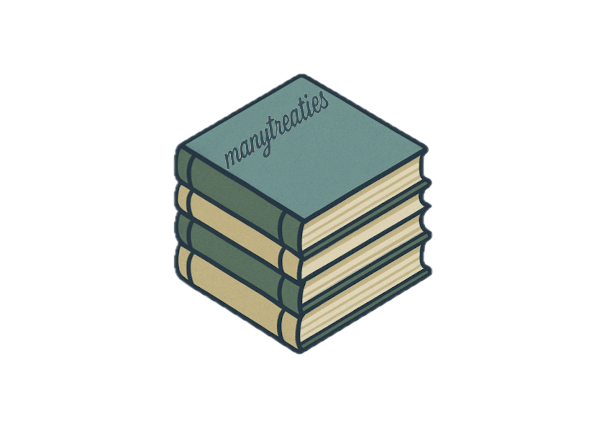

# manytreaties 

## manytreaties

manytreaties is a data package in the many universe of packages.
It currently includes an ensemble of datasets on international environmental, trade, and health agreements,
and [states](https://github.com/globalgov/manystates)' membership or other relationships to those agreements.

Please also check out [`{manydata}`](https://github.com/globalgov) for more information about the other packages in the many universe. 

## How to install:

We’ve made it easier than ever to install and start analysing global governance data in R.
Simply install the core package, [manydata](https://github.com/globalgov/manydata), as outlined below, to discover, install, and update various packages from the many packages universe.

```{r install, eval = FALSE}
remotes::install_github("globalgov/manydata") # this installs our core package, the only one you need to do independently
manydata::call_packages() # this prints a list of the publicly available data packages currently available
manydata::call_packages("manytreaties") # this downloads and installs the named package
```

## Data included

Once you have installed the package, you can see the different datasets included in a specific datacube in the {`manytreaties`} package using the following function.

```{r datasets, eval = FALSE}
manydata::call_sources("manytreaties", "agreements")
```

Working with ensembles of related data has many advantages for robust analysis.
Just take a look at our vignettes [here](https://globalgov.github.io/manydata/articles/user.html).

## Many packages

The development of [many packages](https://github.com/globalgov/manydata) is aimed 
at collecting, connecting, and correcting network data across issue-domains of 
global governance. 

While some many packages can and do include novel data,
much of what they offer involves standing on the shoulders of giants.
Many packages endeavour to be as transparent as possible about where data comes from, 
how it has been coded and/or relabeled, and who has done the work.
As such, we make it easy to cite both the particular datasets you use
by listing the official references in the function above,
as well as the package providers for their work assembling the data
by using the function below.

## Development

### Funding details

Development on this package has been funded by the Swiss National Science Foundation (SNSF)
[Grant Number 188976](https://data.snf.ch/grants/grant/188976): 
"Power and Networks and the Rate of Change in Institutional Complexes" (PANARCHIC).
If you find the package useful, please cite the package.

``` {r cites}
citation("manytreaties")
```

### Contributing

If you have already developed a dataset salient to this package,
please reach out by flagging this as an [issue](https://github.com/globalgov/manystates/issues)
for us, or by forking, further developing the package yourself, and opening a
[pull request](https://github.com/globalgov/manystates/pulls)
so that your data can be made available at the next opportunity.
